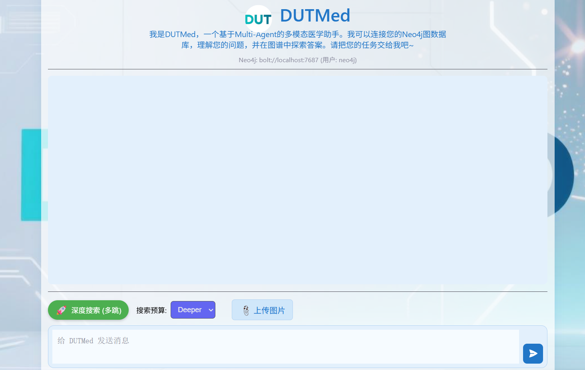

# DUTMed — 基于 Neo4j + LLM 的多模态医学问答系统

**DUTMed** 是一个结合 **知识图谱（Neo4j）** 与 **大语言模型（阿里云通义千问）** 的智能医学问答助手，支持**文本问答、图像分析**，适用于医学教育、临床辅助、科研探索等场景。 



## 🌟 核心功能

- ✅ **智能问答**：基于医学知识图谱 + LLM，精准回答疾病、症状、药品、检查等问题
- ✅ **多跳推理**：支持单跳/多跳查询，深入挖掘关联实体
- ✅ **预算控制**：支持 `Deep` / `Deeper` 模式，平衡速度与深度
- ✅ **图像理解**：上传医学图像 → 自动分割 → 生成结构化描述
- ✅ **流式响应**：实时显示思考过程，透明可解释
- ✅ 快速使用：提供交互式前端，可一键部署使用

## 🚀 快速开始

### 1. 克隆项目

```bash
git clone https://github.com:feiyu1104/DUTMed.git
cd DUTMed
```

### 2.安装依赖

```bash
pip install -r requirements.txt
```

### 3.数据导入

```
python neo4j_import.py
```

### 4.配置环境变量

创建.env文件：

```env
# Neo4j 数据库配置
NEO4J_URI=your_url_here
NEO4J_USER=your_name_here
NEO4J_PASSWORD=your_password_here

# 阿里云通义千问 API
ALI_API_KEY=your_api_key_here
ALI_BASE_URL=https://dashscope.aliyuncs.com/api/v1
ALI_MODEL0 = 'qwen-plus'  # 用于实体识别和答案生成
ALI_MODEL1 = 'qwen-vl-plus'  # 用于图像描述
```

💡 如无阿里云账号，可替换为其他 LLM API（如 OpenAI、本地模型），需修改 `q_a.py` 中 `call_llm` 方法。

### 5.启动应用

```bash
python app.py
```

访问 👉 [http://localhost:5001 ](http://localhost:5001/)即可使用！

## 🧭 使用说明

本项目支持 **Web 界面交互** 和 **终端命令行问答** 两种模式，满足不同场景需求：

### 1️⃣ Web 界面模式

适合：演示、团队协作、非技术人员使用
特点：图形化界面、支持图像上传、实时日志流、模式切换

#### 启动方式：见🚀 快速开始

### 2️⃣ 终端命令行模式

适合：快速测试、批量问答、脚本集成、无 GUI 环境
特点：轻量、快速、支持参数控制、无依赖前端

#### 启动方式：

```bash
# 默认模式（多跳 + Deeper）
python q_a.py

# 多跳 + Deeper
python q_a.py --search_budget Deep

# 禁用多跳 + Deep 模式（轻量快速）
python q_a.py --disable_multi_hop --search_budget Deep

# 禁用多跳 + Deeper 
python q_a.py --disable_multi_hop
```

### 模式对比表

|          |                    |                           |
| -------- | ------------------ | ------------------------- |
| 启动命令 | `python app.py`    | `python q_a.py [参数]`    |
| 交互方式 | 浏览器图形界面     | 终端命令行问答            |
| 图像支持 | ✅ 支持上传与分割   | ❌ 仅文本问答              |
| 实时日志 | ✅ 可视化“思考过程” | ✅ 终端彩色输出（Rich 库） |
| 模式切换 | ✅ 界面按钮/下拉框  | ✅ 命令行参数              |

## 🎥 使用演示

1. ### Web 界面模式

- ### 文本问答


- ### 图像上传

1. ### 终端命令行模式

## 🛠️ 技术架构

## ⚙️ 配置说明

## 🤝 如何贡献

## 📬 联系与支持

如有问题或建议，请：

- 提交 [Issue](https://github.com/your-username/DUTMed/issues)
- 或联系作者：[your-email@example.com](mailto:your-email@example.com)

## 🙏 致谢

- [Neo4j ](https://neo4j.com/)— 图数据库引擎
- [阿里云通义千问 ](https://tongyi.aliyun.com/qianwen/)— 大语言模型支持
- [SAM ](https://github.com/facebookresearch/segment-anything)— 图像分割基础模型
- [Rich ](https://github.com/Textualize/rich)— 终端美化输出
- [Flask ](https://flask.palletsprojects.com/)— Web 框架

> **免责声明**：本系统生成的医学信息仅供参考，不能替代专业医疗建议、诊断或治疗。请在医生指导下进行决策。 