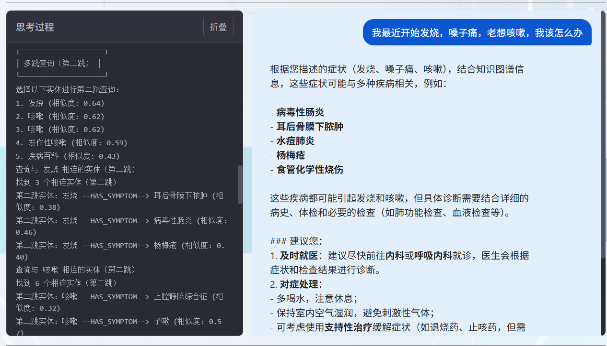
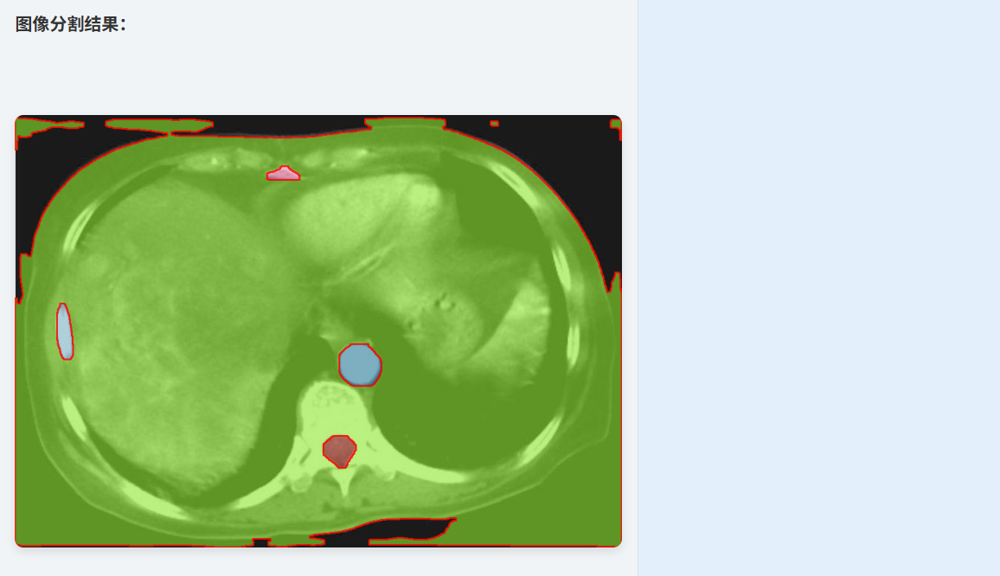
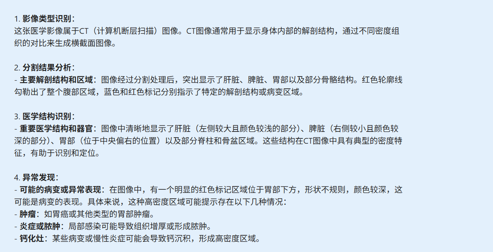
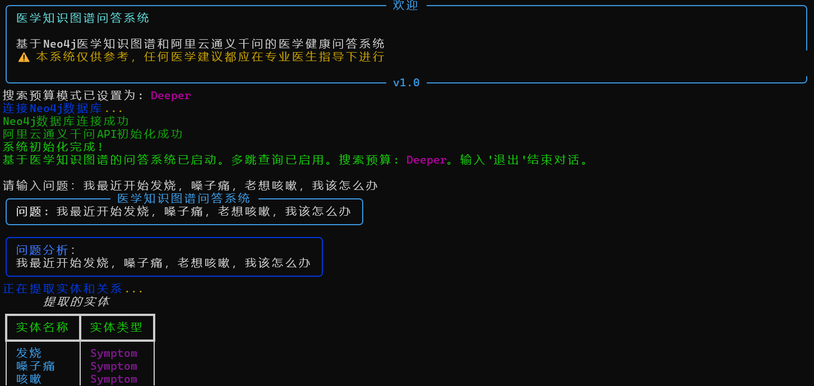
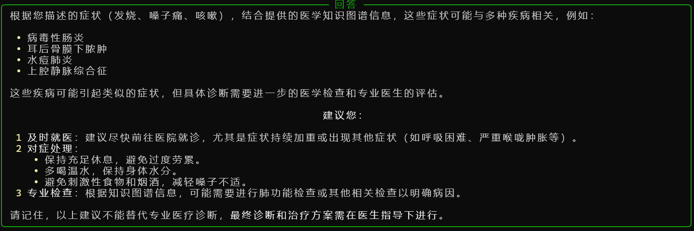

# DUTMed — 基于 Neo4j + LLM 的多模态医学问答系统


---

**DUTMed** 是一个结合 **知识图谱（Neo4j）** 与 **大语言模型（阿里云通义千问)** 的智能医学问答助手，支持**文本问答、图像分析**，适用于医学教育、临床辅助、科研探索等场景。 


## 🌟 核心功能

- ✅ **智能问答**：基于医学知识图谱 + LLM，精准回答疾病、症状、药品、检查等问题
- ✅ **多跳推理**：支持单跳/多跳查询，深入挖掘关联实体
- ✅ **预算控制**：支持 `Deep` / `Deeper` 模式，平衡速度与深度
- ✅ **图像理解**：上传医学图像 → 自动分割 → 生成结构化描述
- ✅ **流式响应**：实时显示思考过程，透明可解释
- ✅ 快速使用：提供交互式前端，可一键部署使用

## 🚀 快速开始

### 1. 克隆项目

```bash
git clone https://github.com:feiyu1104/DUTMed.git
cd DUTMed
```

### 2.安装依赖

```bash
pip install -r requirements.txt
```

### 3.数据导入

```bash
# 安装依赖
pip install neo4j==5.14.1
# 确保Neo4j数据库已启动
# 默认连接信息：
# URI: bolt://localhost:7687
# 用户名: xxx
# 密码: xxxxx
python neo4j_import.py # 运行脚本将数据导入neo4j中，需要等待十几分钟
```

### 4.配置环境变量

创建.env文件：

```env
# Neo4j 数据库配置
NEO4J_URI=your_url_here
NEO4J_USER=your_name_here
NEO4J_PASSWORD=your_password_here

# 阿里云通义千问 API
ALI_API_KEY=your_api_key_here
ALI_BASE_URL=https://dashscope.aliyuncs.com/api/v1
ALI_MODEL0 = 'qwen-plus'  # 用于实体识别和答案生成
ALI_MODEL1 = 'qwen-vl-plus'  # 用于图像描述
```

> 💡 如无阿里云账号，可替换为其他 LLM API（如 OpenAI、本地模型），需修改 `q_a.py` 中 `call_llm` 方法。

### 5.启动应用

```bash
python app.py
```

访问 👉 [http://localhost:5001 ](http://localhost:5001/)即可使用！

## 🧭 使用说明

本项目支持 **Web 界面交互** 和 **终端命令行问答** 两种模式，满足不同场景需求：

### 1.Web 界面模式

适合：演示、团队协作、非技术人员使用
特点：图形化界面、支持图像上传、实时日志流、模式切换

#### 启动方式：见🚀 快速开始

### 2. 终端命令行模式

适合：快速测试、批量问答、脚本集成、无 GUI 环境
特点：轻量、快速、支持参数控制、无依赖前端

#### 启动方式：

```bash
# 默认模式（多跳 + Deeper）
python q_a.py

# 多跳 + Deeper
python q_a.py --search_budget Deep

# 禁用多跳 + Deep 模式（轻量快速）
python q_a.py --disable_multi_hop --search_budget Deep

# 禁用多跳 + Deeper 
python q_a.py --disable_multi_hop
```

### 3.模式对比表

|          |                    |                           |
| -------- | ------------------ | ------------------------- |
| 启动命令 | `python app.py`    | `python q_a.py [参数]`    |
| 交互方式 | 浏览器图形界面     | 终端命令行问答            |
| 图像支持 | ✅ 支持上传与分割   | ❌ 仅文本问答              |
| 实时日志 | ✅ 可视化“思考过程” | ✅ 终端彩色输出（Rich 库） |
| 模式切换 | ✅ 界面按钮/下拉框  | ✅ 命令行参数              |

## 🎥 使用演示

### 1.Web 界面模式

- ### 文本问答



- ### 图像分析




### 2. 终端命令行模式





## 🛠️ 技术架构

```无
Frontend (HTML/CSS/JS)
     ↓ SSE / Fetch
Flask (app.py)
     ↓
Neo4jRAGSystem (q_a.py)
     ├── 实体关系抽取（LLM）
     ├── 知识图谱查询（Neo4j）
     ├── 多跳推理（可选）
     └── 答案生成（LLM）
     ↓
图像模块
     ├── 图像分割（SAM/本地模型）
     └── 图像描述（LLM/Vision Model）
```

## 📊 数据说明

数据来源于`症状.json`文件，包含了丰富的疾病信息，每条记录包含24个字段的医疗数据。

### 1.节点类型（9种）

| 节点类型 | 标签         | 描述               | 示例                         |
| -------- | ------------ | ------------------ | ---------------------------- |
| 疾病     | `Disease`    | 疾病信息（主节点） | 肺炎、糖尿病、高血压         |
| 分类     | `Category`   | 疾病分类           | 内科、呼吸内科、心血管内科   |
| 症状     | `Symptom`    | 疾病症状           | 发热、咳嗽、胸痛             |
| 科室     | `Department` | 治疗科室           | 内科、外科、急诊科           |
| 治疗方法 | `Treatment`  | 治疗方式           | 药物治疗、手术治疗、康复治疗 |
| 检查项目 | `Check`      | 诊断检查           | 血常规、胸部CT、心电图       |
| 药物     | `Drug`       | 药物信息           | 阿奇霉素、青霉素、布洛芬     |
| 食物     | `Food`       | 食物信息           | 鸡蛋、牛奶、辣椒             |
| 食谱     | `Recipe`     | 推荐食谱           | 百合粥、银耳汤、蒸蛋羹       |

### 2.关系类型（11种）

| 关系类型             | 描述               | 示例                                   |
| -------------------- | ------------------ | -------------------------------------- |
| `BELONGS_TO`         | 疾病属于某分类     | (肺炎)-[:BELONGS_TO]->(呼吸内科)       |
| `HAS_SYMPTOM`        | 疾病有某症状       | (肺炎)-[:HAS_SYMPTOM]->(发热)          |
| `TREATED_BY`         | 疾病由某科室治疗   | (肺炎)-[:TREATED_BY]->(呼吸内科)       |
| `USES_TREATMENT`     | 疾病使用某治疗方法 | (肺炎)-[:USES_TREATMENT]->(药物治疗)   |
| `REQUIRES_CHECK`     | 疾病需要某检查     | (肺炎)-[:REQUIRES_CHECK]->(胸部CT)     |
| `RECOMMENDS_DRUG`    | 疾病推荐某药物     | (肺炎)-[:RECOMMENDS_DRUG]->(阿奇霉素)  |
| `COMMONLY_USES_DRUG` | 疾病常用某药物     | (肺炎)-[:COMMONLY_USES_DRUG]->(青霉素) |
| `SHOULD_EAT`         | 疾病宜吃某食物     | (肺炎)-[:SHOULD_EAT]->(鸡蛋)           |
| `SHOULD_NOT_EAT`     | 疾病不宜吃某食物   | (肺炎)-[:SHOULD_NOT_EAT]->(辣椒)       |
| `RECOMMENDS_RECIPE`  | 疾病推荐某食谱     | (肺炎)-[:RECOMMENDS_RECIPE]->(百合粥)  |
| `ACCOMPANIES`        | 疾病伴随其他疾病   | (糖尿病)-[:ACCOMPANIES]->(高血压)      |

### 3.疾病节点属性

每个疾病节点包含以下属性：

- `name`：疾病名称
- `desc`：疾病描述
- `prevent`：预防措施
- `cause`：病因
- `get_prob`：发病概率
- `easy_get`：易患人群
- `get_way`：传播方式
- `cure_lasttime`：治疗时间
- `cured_prob`：治愈概率
- `cost_money`：治疗费用
- `yibao_status`：医保状态

## ⚙️ 配置说明

系统支持通过参数控制 **搜索深度** 与 **计算开销**，在“答案完整性”和“响应速度”之间取得平衡。

### 1. 核心配置参数

|         参数         | 类型 |   默认值   |               说明               |
| :------------------: | :--: | :--------: | :------------------------------: |
|  `enable_multi_hop`  | bool |   `True`   |  是否启用多跳查询（第二跳扩展）  |
| `search_budget_mode` | str  | `"Deeper"` | 搜索预算模式，控制查询范围和数量 |

### 2. 搜索预算模式对比

系统预设两种搜索预算模式，通过 `search_budget_mode` 控制：

#### ✅ `Deeper` 模式（默认，深度优先）

> - **优点**：覆盖范围广，答案更全面
> - **缺点**：查询次数多，响应较慢，API调用成本高

```python
"Deeper": {
​    "entity_limit": 3,           # 单实体查询最多返回3个节点
​    "relation_limit": 10,        # 关系查询最多10条
​    "top_k_triples": 5,          # 最终保留相似度最高的5个三元组
​    "one_hop_limit": 10,         # 第一跳查询最多10条边
​    "top_k_multi_hop_entities": 5, # 选择相似度最高的5个实体进行第二跳
​    "multi_hop_limit": 3         # 第二跳每个实体最多查3条边
}
```

#### ✅ `Deep` 模式（快速模式）

> - **优点**：查询轻量，响应快，节省 API 调用
> - **缺点**：可能遗漏部分关联信息

```python
"Deep": {
​    "entity_limit": 2,
​    "relation_limit": 8,
​    "one_hop_limit": 8,
​    "top_k_triples": 4,
​    "top_k_multi_hop_entities": 4,
​    "multi_hop_limit": 2
}
```

### 3.性能与资源开销对比表

|    配置组合    | 查询深度 | 响应速度 | api次数 |         适用场景         |
| :------------: | :------: | :------: | :-----: | :----------------------: |
|  `Deep`+ 单跳  |  ⚡ 轻量  |   🚀 快   |   少    | 日常问答、演示、低配设备 |
|  `Deep`+ 多跳  |  🌿 中等  |  🐢 中等  |   中    |        平衡型问答        |
| `Deeper`+ 单跳 |  🌲 深度  |   🐢 慢   |   中    |       深度聚焦分析       |
| `Deeper`+ 多跳 |  🌳 超深  |  🐢🐢 慢   |   多    | 科研、复杂推理、完整答案 |

> ⚠️ **注意**：每次查询都会调用多次 Embedding API（计算相似度）和 1~2 次 Chat API（抽取 + 生成），请合理控制使用频率，避免 API 限流或费用超支。 

## 📬 联系与支持

如有问题或建议，请：

- 提交 [Issue]([议题 · feiyu1104/DUTMed](https://github.com/feiyu1104/DUTMed/issues)s)
- 或联系我们：[feiyucom@outlook.com](mailto:feiyucom@outlook.com)

## 🙏 致谢

- [Neo4j ](https://neo4j.com/)— 图数据库引擎

- [阿里云通义千问 ](https://tongyi.aliyun.com/qianwen/)— 大语言模型支持

- [SAM ](https://github.com/facebookresearch/segment-anything)— 图像分割基础模型

- [Rich ](https://github.com/Textualize/rich)— 终端美化输出

- [Flask ](https://flask.palletsprojects.com/)— Web 框架

- 感谢所有**贡献者**！完整名单请见 [CONTRIBUTORS.md](CONTRIBUTORS.md)

  我们也欢迎你加入贡献者行列 🎉


> **免责声明**：本系统生成的医学信息仅供参考，不能替代专业医疗建议、诊断或治疗！请在医生指导下进行决策！


